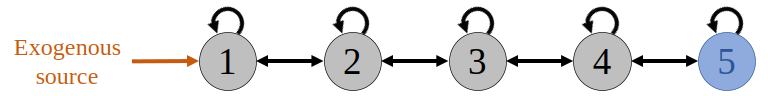

<!-- Justify text -->
<style> body{ text-align: justify } </style>

In this vignette, we present two examples on how to use the **tdsa** package to calculate time-dependent state and parameter sensitivities; see @ng_etal_2023a or @ng_etal_2023b for the definitions. The examples are based on models presented in @ng_etal_2023a, although our focus here will be on the code syntax and not the results.

Before proceeding, we load the two packages that we will use in this example.
```{r}
library(tdsa)
library(viridisLite)  # For the colours used in some of the plots.
```

<br>
<hr style="border: 2px solid black">
<br>

## Example 1: Translocating individuals into a sink habitat that is being restored

### Background

This is the example in the help page of the function `state_sens`, and was also presented in @ng_etal_2023a. Consider an organism in a sink habitat, where the per-capita loss rate (mortality and emigration combined) exceeds the per-capita unregulated birth rate, so the population is only maintained through immigration. However, the mortality rate is expected to decrease over time due to ongoing habitat restoration efforts, so the population should eventually become self-sustaining. The population dynamics is hence given by
$$\frac{dy}{dt} = by(t)(1 - ay(t)) - \mu(t)y(t) + \sigma,$$
where $y(t)$ is the population at time $t$, $b$ the unregulated per-capita birth rate, $a$ the coefficient for reproductive competition, $\mu(t)$ the time-varying per-capita loss rate, and $\sigma$ the immigration rate. We assume that $\mu(t)$ starts off above $b$ (so it is a sink habitat), but decreases as a sigmoid and eventually falls below $b$ (so the population becomes self-sustaining).

The organism provides an important ecosystem service. Over a management period from $t_0$ to $t_1$, we ascribe a value to the organism (the reward function)
$$J=\int_{t_0}^{t_1} \underbrace{w y(t)}_{\substack{\text{reward}\\\text{integrand}}} dt + \underbrace{v y(t_1)}_{\substack{\text{terminal}\\ \text{payoff}}}.$$
Here, it is assumed that each individual provides the service at a rate $w$, so the integral gives the total amount of service accumulated over the period. However, we also want to ascribe value to maintaining a large population at the end of the management period, so the second term corresponds to a terminal payoff where $v$ is the ascribed value per individual.

Say we want to translocate individuals to the habitat to speed up the population recovery and increase the reward $J$. What is the best time to do so in order to maximise the increase in the reward? As early as possible? Or only when the loss rate has become low enough that the population can sustain itself? A one-off translocation causes a small, sudden increase in the population size, so it is useful to look at the time-dependent state sensitivity. Alternatively, we can interpret the translocation as a brief spike in the immigration rate $\sigma$, so we can also look at the time-dependent parameter sensitivity of $\sigma$.

<br>

### Preparing the input arguments

To perform time-dependent sensitivity analysis using the function `state_sens`, we need to prepare the input arguments:

1. `dynamic_fn`, a function of the form `function(t, y, parms, ...)` that returns the RHS of the dynamic equations. For consistency with the syntax of the **deSolve** package (which many users might already be familiar with), the output must be a list, the first element a numeric vector of length equal to the number of state variables (which is just one in this example).

2. `parms`, an object used to specify input parameters for `dynamic_fn`. (We will discuss other ways to specify input parameters later.)

3. `reward_fn`, a function of the form `function(t, y, ...)` that returns the integrand in the reward function.

4. `terminal_fn`, a function of the form `function(y)` that returns the terminal payoff.

5. `y_0`, a numeric vector used to specify the initial conditions $y(t_0)$.

6. `times`, a numeric vector used to specify the discretised time steps between $t_0$ and $t_1$ (inclusive) used in the simulation.

```{r}
# Parameter values for the dynamic equations.
parms = list(
  b = 1,                                          # Per-capita birth rate.
  a = 0.1,                                        # Competition coefficient.
  mu = function(t){0.5 + 1/(1 + exp((t-10)/2))},  # Per-capita loss rate.
  sigma = 0.2                                     # Immigration rate.
)

# Function that returns the dynamic equations.
dynamic_fn = function(t, y, parms){
  b = parms[["b"]]
  a = parms[["a"]]
  sigma = parms[["sigma"]]
  mu = parms[["mu"]](t)
  
  dy = b*y*(1- a*y) - mu*y + sigma
  return( list(dy) )
}

# Initial conditions.
y_0 = 0.37  # Approximate steady-state population before restoration efforts.

# Function that returns the reward integrand.
reward_fn = function(t, y){
  w = 1  # Per-capita rate at which the ecosystem service is provided.
  return( w * y )
}

# Function that returns the terminal payoff.
terminal_fn = function(y){
  v = 1.74  # Ascribed value per individual at the end of the period.
  return( v * y )
}

# Time steps over management period. We discretise it into 1001 time steps
# (so the step size is 0.02).
times = seq(0, 30, length.out=1001)
```


<br>

### Calculating time-dependent state sensitivities

We first calculate time-dependent state sensitivities using the function `state_sens`. Since this is a continuous-time model, we choose `model_type = "continuous"`.
```{r, results="hide"}
state_sens_out = state_sens(
  model_type = "continuous",
  dynamic_fn = dynamic_fn,
  parms = parms,
  reward_fn = reward_fn,
  terminal_fn = terminal_fn,
  y_0 = y_0,
  times = times
)
```

The output is a list that contains some of the input arguments such as `times` that will be needed to calculate parameter sensitivities later on, as well as two matrices. The first matrix, called `state`, gives the state variable $y$ at each time step in `times`. Users of the **deSolve** package should find this familiar, except that we have removed the first column containing the time steps. The second matrix, called `tdss`, gives the state sensitivity $\lambda$ also at each time step in `times`.
```{r}
str(state_sens_out)
```

In the left panel below, we plot the per-capita unregulated birth and loss rates, from `parms`. They intersect at around $t=10$. The middle panel shows the population size, from the abovementioned `state` matrix. The right panel shows the time-dependent state sensitivity, from the `tdss` matrix. We see that the sensitivity also peaks at around $t=10$, so translocation is most effective when the population has just become self-sustaining, an intuitive result.
```{r, fig.dim=c(12,4)}
# Set graphical parameters.
par(mfrow=c(1,3), cex=1)
par(mar=c(3.2,3.2,2,2), mgp=c(2,0.7,0), cex.lab=1.2)

# Plot the per-capita unregulated birth and loss rates.
plot(times, parms[["mu"]](times), type="l", lwd=2,
     xlab="Time (year)", ylab="Demographic rate (/year)")
abline(h=parms[["b"]], col="red", lwd=2)
legend("topright", col=c("red", "black"), lwd=2, bty="n",
       legend=c("Birth rate", "Loss rate"))

# Plot the population size.
plot(times, state_sens_out[["state"]][,1], type="l", lwd=2,
     xlab="Time (year)", ylab="Population size y")

# Plot the time-dependent state sensitivity. Peaks at around t=10, which is
# roughly when mu and b intersects, so the population has just become
# self-sustaining.
plot(times, state_sens_out[["tdss"]][,1], type="l", lwd=2,
     xlab="Time (year)", ylab="State sensitivity of y")
```

<br>

### Calculating time-dependent parameter sensitivities

Once we have calculated the state sensitivities, calculating the parameter sensitivities is easy---all we have to do is to use the output of the function `state_sens` as the input argument of the function `parm_sens`.
```{r, results="hide"}
parm_sens_out = parm_sens(state_sens_out = state_sens_out)
```

The output is a list containing two elements. The first element is `times`, while the second element `tdps` is an object that gives the time-dependent parameter sensitivities. The structure of `tdps` depends on the structure of `parms`.

1. If `parms` is a numeric object (vector, matrix or array), or a function that returns a numeric object (for time-varying parameters), then `tdps` is an array with one more index than the object, so a vector becomes a matrix, a matrix becomes a 3-index array, etc. The first index indicates the time step.

2. If `parms` is a list containing any combination of the above, then `tdps` is a list with the above rule applied element-wise.

In this example, `parms` is a list containing single-number parameters `b`, `a`, `sigma` and `mu` (since `mu` is a function that returns a single number), so `tdps` is a list containing a one-column matrix for each parameter.
```{r}
str(parm_sens_out)
```

Below, we plot the parameter sensitivity of $\sigma$. We find that it is identical to the state sensitivity, which is not surprising since a brief spike in $\sigma$ leads to a sudden increase in the population size and hence the same increase in $J$.
```{r, fig.dim=c(4,4), out.width="33%"}
# Set graphical parameters.
par(mar=c(3.2,3.2,2,2), mgp=c(2,0.7,0), cex.lab=1.2)

# Plot the parameter sensitivity of sigma.
plot(times, parm_sens_out[["tdps"]][["sigma"]][,1], type="l", lwd=2,
     xlab="Time (year)", ylab="Param. sensitivity of sigma")
```

<br>
<hr style="border: 2px solid black">
<br>

## Example 2: Exogenous disease spillover in a linear network

### Background

We now move on to a more complicated example, involving disease transmission in a sink community with five species. The disease cannot maintain itself in the community and only persists via exogenous spillover to Species 1. Interspecific transmission only occurs between "nearest-neighbour" species, leading to a linear network as shown in the figure below.

Species 5 is a species of management concern because it provides an important ecosystem service but has a vulnerable population, due to its low birth rate and high disease-induced mortality. To reduce disease transmission to Species 5, we may want to cull an intermediate species or dilute a transmission link, so we will use TDSA to help us identify what and when to target. See @ng_etal_2023a for details.



The state variables are $S_j$ and $I_j$, the number of susceptible and infected individuals in species $j$, so $N_j\equiv S_j+I_j$ gives the species population size. The dynamic equations are first-order ordinary differential equations
$$\begin{aligned} 
\frac{dS_j}{dt} &=B_j N_j (1 - a_j N_j) - S_j \left(\sigma_j + \sum_{k=1}^m b_{j,k} I_k \right) - \mu_j S_j + \gamma_j I_j,\\
\frac{dI_j}{dt} &= S_j \left(\sigma_j + \sum_{k=1}^m b_{j,k} I_k \right) - (\mu_j + \nu_j + \gamma_j) I_j,
\end{aligned}$$
where $B_j$ is the unregulated per-capita birth rate, and $a_j$ the coefficient for intraspecific reproductive competition. For a susceptible individual, $\mu_j$ is the mortality rate, while for an infected individual, $\nu_j$ is the additional disease-induced mortality rate and $\gamma_j$ the recovery rate. $b_{j,k}$ is the transmission coefficient from species $k$ to $j$, and $\sigma_j$ the per-capita exogeneous spillover rate.

Each year, Species 5 provides the ecosystem service over an active season from $t_0=0$ to $t_1=1$ in units of lifespan. (We assume that all five species are relatively short-lived.) The reward $J$ represents the total value of this service, and is given by
$$J = \int_{t_0}^{t_1} \underbrace{\sum_{j=1}^5 W_j N_j}_{\substack{\text{reward}\\\text{integrand}}}\, dt+ \underbrace{\sum_{j=1}^5 V_j N_j(t_1)}_{\text{terminal payoff}},$$
where $W_j$ is the per-capita rate of contribution to the service. We also include a terminal payoff to ascribe a value to maintaining a large population at the end of the season, since this will affect the population size next season.

<br>

### Preparing the input arguments

As before, we need to prepare the input arguments for the function `state_sens`. Now, because there are more parameters, we need to think about how we want the parameter values to be assigned in `dynamic_fn`. The following options are available.

1. Using the argument `parms` as was done earlier. Only parameters assigned this way are recognised by the function `parm_sens` used to calculate parameter sensitivities.

2. Using a different argument of our choice. This is permitted, since the `...` in `function(t, y, parms, ...)` means that we are free to introduce any additional arguments we want.

3. Within the environment of the function itself.

4. In the global environment.

Here, we will use the first two options simultaneously, by splitting the model parameters into two lists `parms` and `parms2`. `parms` contains parameters whose sensitivities we are interested in, while `parms2` is a new input argument of `dynamic_fn` that contains all other parameters. Note that this split is not really necessary---it is perfectly fine to assign all parameters using `parms` alone. However, keep in mind that the function `parm_sens` will calculate the sensitivities for *all* parameters assigned using `parms`, so we waste a lot of computation time if there are many model parameters that we are not interested in.
```{r}
parms = list(
  mu = c(1, 1, 1, 1, 1),  # Mortality rate of a susceptible individual.
  b = matrix(c(1.976537, 1.976537, 0.000000, 0.000000, 0.000000,
               1.976537, 1.976537, 1.976537, 0.000000, 0.000000,
               0.000000, 1.976537, 1.976537, 1.976537, 0.000000,
               0.000000, 0.000000, 1.976537, 1.976537, 1.976537,
               0.000000, 0.000000, 0.000000, 1.976537, 1.976537),
             nrow=5, byrow=T)  # Matrix of transmission coefficients; values chosen so that disease R_0 = 0.9. 
)

parms2 = list(
  B = c(5, 5, 5, 5, 1.02),  # Unregulated per-capita birth rate; low for Species 5.
  a = c(0.8, 0.8, 0.8, 0.8, 0.02),  # Intraspecific competition; chosen so all species have disease-free carrying capacity = 1.
  nu = c(0, 0, 0, 0, 5),  # Disease-induced mortality of an infected individual; only nonzero for Species 5.
  gamma = c(5, 5, 5, 5, 0),  # Recovery rate of an infected individual; zero for species 5.
  sigma = c(0.2, 0, 0, 0, 0)  # Per-capita exogenous spillover rate; only nonzero for Species 1.
)
```

We can now specify `dynamic_fn`. Since there are five species, each with two compartments (susceptible and infected), the input argument `y` is a numeric vector of length 10, corresponding to the state vector
$$\vec{y}=\begin{pmatrix}\vec{S}\\\vec{I}\end{pmatrix}, \quad \vec{S}=(S_1, S_2, S_3, S_4, S_5)^{\mathsf{T}}, \quad \vec{I}= (I_1, I_2, I_3, I_4, I_5)^{\mathsf{T}}.$$
`dynamic_fn` must return a list, the first element a numeric vector of length 10 corresponding to the RHS of the dynamic equations (in vector form)
$$\frac{d\vec{y}}{dt}
=\begin{pmatrix}\frac{d\vec{S}}{dt}\\ \frac{d\vec{I}}{dt}\end{pmatrix}
=\begin{pmatrix} \vec{B} \circ\vec{N}\circ(1-\vec{a}\circ\vec{N})-\vec{S}\circ(\vec{\sigma}+\mathbf{b}\vec{I}) -\vec{\mu}\circ\vec{S}+\vec{\gamma}\circ\vec{I}  \\ \vec{S}\circ(\vec{\sigma}+\mathbf{b}\vec{I}) -(\vec{\mu}+\vec{\nu}+\vec{\gamma})\circ\vec{I} \end{pmatrix}.$$
Here, $\circ$ corresponds to the Hadamard (element-wise) product. The interpretation of parameter vectors and matrices such as $\vec{B}$ and $\mathbf{b}$ should be clear.
```{r}
dynamic_fn = function(t, y, parms, parms2){
  # To make the lines below easier to read, we "extract" each coefficient from the parameter lists.
  mu = parms[["mu"]]
  b = parms[["b"]]
  
  B = parms2[["B"]]
  a = parms2[["a"]]
  nu = parms2[["nu"]]
  gamma = parms2[["gamma"]]
  sigma = parms2[["sigma"]]

 # To make the lines below easier to read, we "extract" the susceptible and infected parts from the state vector.
  SS = y[1:5 ]
  II = y[6:10]
  
  # Calculate the species population size.
  NN = SS + II
  
  # RHS of the dynamic equations.
  dSS = B * NN * (1 - a*NN) - SS * (sigma + b%*%II) - mu * SS + gamma * II
  dII = SS * (sigma + b%*%II) - (mu + nu + gamma) * II
  
  return( list( c(dSS, dII) ) )
}
```

Next, we need to specify `reward_fn` and `terminal_fn` for the reward integrands and terminal payoffs.
```{r}
reward_fn = function(t, y){
  # Parameters.
  W = c(0, 0, 0, 0, 1)  # Per-capita rate of contribution to ecosystem service; only nonzero for Species 5.

  # Split the state vector.
  SS = y[1:5]
  II = y[6:10]
  
  # Return the reward integrand.
  NN = SS + II
  return( sum(W * NN) )
}


terminal_fn = function(y){
  # Parameters.
  V = c(0, 0, 0, 0, 1)  # Per-capita terminal payoff; only nonzero for Species 5.

  # Split the state vector.
  SS = y[1:5]
  II = y[6:10]
  
  # Return the terminal payoff.
  NN = SS + II
  return( sum(V*NN) )
}
```

Next, we need to specify `y_0`, the initial conditions $\vec{y}(t_0)$. We assume that the community starts off disease-free at the carrying capacity $K_j = (1-\mu_j/B_j)/a_j$.
```{r}
SS_0 = (1-parms[["mu"]]/parms2[["B"]])/parms2[["a"]]     # At carrying capacity.
II_0 = c(0, 0, 0, 0, 0)  # Disease-free.
y_0  = c(SS_0, II_0)
```

Finally, since this is a continuous-time model, we need to discretise the continuous time interval between the initial and final times $t_0=0$ and $t_1=5$. We choose 1001 time steps, so the step size is 0.005. When using the function `seq`, it is more "fail-safe" to specify the argument `length.out` (number of time steps) instead of `by` (step size), to ensure that $t_1$ is always the final time step.
```{r}
t_0 = 0
t_1 = 5
times = seq(from=t_0, to=t_1, length.out=1001)
```

<br>

### Calculating time-dependent state sensitivities

We calculate time-dependent state sensitivities using the function `state_sens`. Since `parms2` is a new argument of `dynamic_fn`, we use the argument `dynamic_fn_arglist` to specify it in `state_sens`.
```{r, results="hide"}
state_sens_out = state_sens(
  model_type = "continuous",
  dynamic_fn = dynamic_fn,
  parms = parms,
  reward_fn = reward_fn,
  terminal_fn = terminal_fn,
  y_0 = y_0,
  times = times,
  dynamic_fn_arglist = list(parms2 = parms2),
)
```

As before, the output is a list that contains some input arguments, as well as the matrices `state` and `tdss` These matrices now have 10 columns, since there are now 10 state variables, and also 10 state sensitivities
$$\vec{\lambda}=\begin{pmatrix}\vec{\lambda}_S\\\vec{\lambda}_I \end{pmatrix}, \quad \vec{\lambda}_S=(\lambda_{S_1},\lambda_{S_2},\lambda_{S_3},\lambda_{S_4},\lambda_{S_5})^{\mathsf{T}},\quad \vec{\lambda}_I=(\lambda_{I_1},\lambda_{I_2},\lambda_{I_3},\lambda_{I_4},\lambda_{I_5})^{\mathsf{T}}.$$.
```{r}
str(state_sens_out)
```

In the left panel below, we plot the disease prevalence $P_j\equiv I_j/N_j$ in each species, calculated from the `state` matrix. Since the disease has to be relayed down the transmission chain, not surprisingly the prevalence is a lot lower in Species 5. In the right panel, we plot $-\lambda_{N_j}$, defined as $\lambda_{N_j}=(1-P_j)\lambda_{S_j}+P_j\lambda_{I_j}$. This represents the sensitivity of the reward $J$ to random culling of Species $j$, regardless of infection status. (It makes no sense to cull Species 5 so we have excluded it from the plot.) We find that early in the season, it is more effective to cull a species that is "upstream" along the transmission chain, whereas the reverse is true late in the season.
```{r, fig.dim=c(12,6)}
# Calculate the derived quantities to be plotted.

# Disease prevalence:
SS = state_sens_out[["state"]][, 1:5]  # Number of susceptible individuals.
II = state_sens_out[["state"]][, 6:10]  # Number of infected individuals.
NN = SS + II  # Species population size.
PP = II / NN  # Disease prevalence.

# State sensitivities:
lambda_SS = state_sens_out[["tdss"]][, 1:5]  # State sensitivities for S_j.
lambda_II = state_sens_out[["tdss"]][, 6:10]  # State sensitivities for I_j.
lambda_NN = (1 - PP) * lambda_SS + PP * lambda_II

# Generate the plots.
palette = plasma(5, begin=0.1, end=0.9)  # Colour palette.

par(mar=c(5,6.7,4,1.7)+0.1, mfrow=c(1,2))  # Set graphical parameters.

# Plot PP.
plot(NA, xlim=c(0, 5), ylim=c(0.00067, 1), log="y", xaxs="i", yaxs="i", yaxt="n",
     main="Infection dynamics",
     xlab="Time (in units of lifespan)",
     ylab="Fraction of population infected (log scale)",
     cex.main=2, cex.lab=1.5, cex.axis=1.5)
axis(side=2, cex.axis=1.5, at=10^((-4):(0)), labels=c(0.0001, 0.001, 0.01, 0.1, 1))
for(i in 1:5){
  lines(times, PP[,i], lwd=3, col=palette[i])
}
legend("topright", legend=paste("Species",1:5), lwd=3, col=palette[1:5], bty="n")

# Plot lambda_NN.
plot(NA, xlim=c(0, 5), ylim=c(0, 0.11), xaxs="i", yaxs="i",
     main="Time-dep. state sensitivities",
     xlab="Time (in units of lifespan)",
     ylab=bquote(atop("Sensitivity of J to sudden decrease", "in species population "~(-lambda[N["j"]]))),
     cex.main=2, cex.lab=1.5, cex.axis=1.5)
for(i in (1:4)){
  lines(times, -lambda_NN[,i], lwd=3, col=palette[i])
}
legend("topright", legend=paste("Species",1:4), lwd=3, col=palette[1:4], bty="n")
```

<br>

### Calculating time-dependent parameter sensitivities

Again, calculating the parameter sensitivities is easy, since it only involves using the output of `state_sens` as the input argument of the function `parm_sens`. To speed up the calculation of numerical derivatives, we will also use the optional argument `numDeriv_arglist` to reduce the number of Richardson iterations to two (see the **numDeriv** package help for details).
```{r, results="hide"}
parm_sens_out = parm_sens(state_sens_out = state_sens_out,
                          numDeriv_arglist = list(method.args=list(r=2)))
```

As before, the output is a list containing `times`, and an object called `tdps` that gives the time-dependent parameter sensitivity. In this example, `parms` is a list containing a vector `mu` and a matrix `b`, so `tdps` is a list containing a matrix and a 3-index array that give the parameter sensitivities of `mu` and `b` respectively.
```{r}
str(parm_sens_out)
```

In the left panel below, we plot (excluding Species 5) $\kappa_{\mu_j}$, the parameter sensitivities of $\mu_j$. We note that the shape is similar to the negative of the state sensitivities $-\lambda_{N_j}$, which is not surprising because a brief spike in mortality leads to a sudden decrease in the population size. In the right panel, we plot $-\kappa_{b_{j+1,j}}$, the negative of the parameter sensitivities of the "forward" transmission coefficients $b_{2,1}$, $b_{3,2}$, etc. We find that early in the season, it is more effective to target an "upstream" transmission link, whereas the reverse is true late in the season.

```{r, fig.dim=c(12,6)}
# Extract the list containing the parameter sensitivities.
tdps = parm_sens_out[["tdps"]]

# Parameter sensitivities for the mortality rate of a susceptible individual.
kappa_mu = tdps[["mu"]]

# Parameter sensitivities for the forward transmission rate b_{2,1}, b_{3,2}, etc.
# These are given by tdps[["b"]][,2,1], tdps[["b"]][,3,2], etc.
# A more systematic way to extract these elements is to use mapply.
kappa_b = mapply(function(i,j){tdps[["b"]][,i,j]}, 2:5, 1:4)


# Generate the plots.
palette = plasma(5, begin=0.1, end=0.9)  # Colour palette.

par(mar=c(5,6.7,4,1.7)+0.1, mfrow=c(1,2))  # Set graphical parameters.

# Plot kappa_mu.
plot(NA, xlim=c(0, 5), ylim=c(0, 0.11), xaxs="i", yaxs="i",
     main="Time-dep. parm. sensitivities",
     xlab="Time (in units of lifespan)",
     ylab=bquote(atop("Sensitivity of J to brief increase", "in mortality of susceptibles "~(kappa[mu["j"]]))),
     cex.main=2, cex.lab=1.5, cex.axis=1.5)
for(i in 1:4){
  lines(times, kappa_mu[,i], lwd=3, col=palette[i])
}
legend("topright", legend=paste("Species",1:4), lwd=3, col=palette[1:4], bty="n")

# Plot kappa_b
plot(NA, xlim=c(0, 5), ylim=c(0, 0.077), xaxs="i", yaxs="i",
     main="Time-dep. parm. sensitivities",
     xlab="Time (in units of lifespan)",
     ylab=bquote(atop("Sensitivity of J to brief decrease", "in forward transmission "~(-kappa[b["j+1, j"]]))),
     cex.main=2, cex.lab=1.5, cex.axis=1.5)
for(i in 1:4){
  lines(times, -kappa_b[,i], lwd=3, col=palette[i])
}
legend("topright", legend=paste("Species", 1:4, "to", 2:5), lwd=3, col=palette[1:4], bty="n")
```


## Bibliography

Ng, W. H., Myers, C. R., McArt, S., & Ellner, S. P. (in review). A time for every purpose: using time-dependent sensitivity analysis to help understand and manage dynamic ecological systems. *American Naturalist*. doi: [10.1101/2023.04.13.536769](https://doi.org/10.1101/2023.04.13.536769).

Ng, W. H., Myers, C. R., McArt, S., & Ellner, S. P. (in prep). **tdsa**: An R package to perform time-dependent sensitivity analysis. *Methods in Ecology and Evolution*.