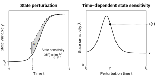
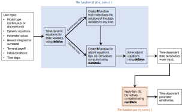

<!--
%\VignetteEngine{knitr::rmarkdown}
%\VignetteIndexEntry{What is time-dependent sensitivity analysis (TDSA)?}
-->

---
title: "What is time-dependent sensitivity analysis (TDSA)?"
author:
  - "Wee Hao Ng"
date: "August 31, 2023"
link-citations: true
output:
  html_document:
    toc: true
  pdf_document: default
---

<!-- Justify text -->

 

Sensitivity analysis describes how a dynamical system responds to perturbations of the model parameters or state variables. This can be used to help understand and manage ecological systems; for example, Crouse et al. (1987) found that the population growth rate of loggerhead sea turtles was more sensitive to adult survival at sea than to egg or hatchling survival, which eventually led to the policy of installing "turtle excluder devices" on fishing nets in the United States.

Most forms of sensitivity analysis assume that the perturbations are time-invariant. For example, traditional sensitivity analysis of population projection matrix models often involves calculating $d\lambda/d\theta_i$, where $\lambda$ is the steady-state population growth rate, and $\theta_i$ is some demographic parameter of interest; this tells us how a small constant change in $\theta_i$ can affect $\lambda$. Even transient sensitivity analysis, introduced in Caswell (2007), assumes a constant perturbation; time dependence only occurs because of the choice of non-steady state objectives, e.g. the population size $N(t)$ at some time of interest $t$. However, many management interventions involve perturbations that are localised in time, e.g. a one-off cull or translocation, in which case the timing of the intervention may be just as important as the choice of intervention to perform. For example, there is not much point in culling a wild disease reservoir species after the disease has already spilled over to livestock and is now mainly spread via direct transmission between livestock. The goal of time-dependent sensitivity analysis (TDSA) is twofold: first to provide a useful definition of sensitivity that incorporates the timing of the perturbation, and second to offer a computationally efficient way of calculating this sensitivity.

In this vignette, we briefly introduce the mathematics of TDSA, in particular the definition of the time-dependent sensitivity and how to compute it using the adjoint method. We also describe the algorithm used in the **tdsa** package to automate all the steps required for TDSA. Finally, we suggest best practices when performing TDSA to avoid pitfalls that can lead to incorrect management decisions. More details can be found in Ng et al. (in press) and Ng et al. (in review).

 

 

## The mathematics of TDSA

### The setup

TDSA works for systems whose dynamics are well-approximated by deterministic models. In this vignette, we will focus on continuous-time models, specifically those that can be written as first-order ordinary differential equations (ODEs)
$$
\frac{dy_i(t)}{dt}=g_i(t,\vec{y}(t)), \quad \vec{y}(t_0)=\vec{y}_0,
\tag{1}
$$
where $\vec{y}(t)$ is the $n_y$-dimensional state vector at time $t$. (See the references for discrete-time recurrence equation models.) We are interested in some objective that is a functional of the state trajectory over a management period from $t_0$ to $t_1$, and we assume that the objective can be written as
$$
J = \int_{t_0}^{t_1} f(t,\vec{y}(t)) dt + \Psi(\vec{y}(t_1)).
\tag{2}
$$
The integrand $f(t,\vec{y}(t))$ in the first term represents a value accumulation rate that depends on the state of the system $\vec{y}(t)$, so the integral gives the total value accumulated over the period. For example, the instantaneous rate may be the rate of harvesting at a fishery, so the first term gives the total number of fish harvested. The second term $\Psi(\vec{y}(t_1))$ is usually called the terminal payoff, and only depends on the state $\vec{y}(t_1)$ at the end of the period $t_1$. The terminal payoff is often included so that management decisions do not only focus on maximising the value during the period at the expense of leaving the system in a worse state after the period. For example, it may incentivise having a high remaining fish stock at time $t_1$. We will explain how to deal with non-standard objectives that cannot be expressed in such a form in a future vignette.

  

### Time-dependent state sensitivity

Consider a sudden perturbation of the $i$th state variable $y_i$ by an amount $\epsilon$ at time $t$, so $y_i(t)\to y_i(t)+\epsilon$. For example, this may correspond to a sudden decrease in the population of a wild disease reservoir species following a one-off cull (so $\epsilon$ is negative), to reduce the chance of disease spillover to livestock. The dynamic equations are assumed to be unchanged after the perturbation, so the perturbation simply nudges the system into a new state trajectory starting at time $t$. Let $\Delta J$ be the change in the objective as a result of being nudged into this new trajectory. We define the time-dependent state sensitivity as
$$
\lambda_i(t) = \lim_{\epsilon \to 0}\frac{\Delta J}{\epsilon}.
\tag{3}
$$

This sensitivity is time-dependent because $\Delta J$ may depend on when the sudden perturbation occurs. For example, if the contact rate between the disease reservoir and livestock varies seasonally, and if the objective $J$ is the total number of reservoir-livestock contacts, then we expect a bigger reduction in $J$ if we cull the reservoir before peak contact rate occurs.

In principle, one can calculate $\lambda_i(t)$ directly: perform the perturbation described above for some small $\epsilon$, calculate the change in the state trajectory and hence $\Delta J$, and then apply the definition above, assuming that $\epsilon$ is small enough to approximate the $\epsilon \to 0$ limit. However, if we want compare the sensitivities between different choices of state variables and perturbation times, this will have to be repeated for each $i$ and $t$, which is computationally very inefficient. Also, since the direct approach involves subtracting two quantities ($J$ with and without the perturbation) to obtain a much smaller quantity $\Delta J$, the numerical errors can be large.

A much more efficient and accurate way is to use the adjoint method, motivated by optimal control theory (Pontryagin et al. 1962). It can be shown that the time-dependent sensitivity satisfies the following ODEs and terminal conditions (also known as the adjoint equations)
$$
\frac{d\lambda_i(t)}{dt}=-\left.\frac{\partial f(t,\vec{y})}{\partial y_i}\right|_{\vec{y}=\vec{y}(t)}-\sum_{j=1}^{n_y}\lambda_j(t)\left.\frac{\partial g_j(t,\vec{y})}{\partial y_i}\right|_{\vec{y}=\vec{y}(t)}, \quad \lambda_i(t_1)=\left.\frac{\partial \Psi(\vec{y})}{\partial y_i}\right|_{\vec{y}=\vec{y}(t_1)}.
\tag{4}
$$
Notice that here we are given the terminal conditions $\lambda_i(t_1)$ instead of the initial conditions $\lambda_i(t_0)$, so we will need to solve the adjoint equations backward in time. Also, the adjoint equations are non-autonomous, with inhomogeneous terms and coefficients that depend on $\vec{y}(t)$, so we will need to know the state trajectory as well. Hence, the adjoint method involves two steps&mdash;first solving the dynamic equations forward in time to obtain the state trajectory, so that we can specify the values of $\vec{y}(t)$ in the adjoint equations, then solving the adjoint equations backward in time to obtain the state sensitivities $\lambda_i(t)$ for each $i$ and $t \in [t_0,t_1]$.

  

### Time-dependent parameter sensitivity

Often, a sudden change in a state variable can also be interpreted as a brief change (spike or dip) in one or more model parameters. For example, a one-off translocation is equivalent to a temporary spike in the immigration rate. Conversely, a brief change in a model parameter can lead to a sudden change in one or more state variables. We use this idea to motivate our definition of the parameter sensitivity.

Let $\vec{b}$ be a vector of model parameters (which can be time-varying). We colloquially define the time-dependent parameter sensitivity $\kappa_i(t)$ as the sensitivity of the objective $J$ to a brief perturbation in $b_i$ at time $t$; see Ng et al. (in review) for a more precise definition. The parameter sensitivity can be calculated from the state sensitivities $\lambda_i(t)$ using
$$
\kappa_i(t)=\left.\sum_{j=1}^{n_y}\frac{\partial g_j(t,\vec{y}(t),\vec{b})}{\partial b_i}\right|_{\vec{b}=\vec{b}(t)}\lambda_j(t),
\tag{5}
$$
where we have rewritten $g_i(t,\vec{y}(t))$ from Eqn. (1) as $g_i(t,\vec{y}(t),\vec{b}(t))$ to make the parameter dependence more explicit.

The parameter sensitivities $\kappa_i(t)$ can themselves be used to derive the sensitivity to a more general temporal pattern of parameter perturbation. For example, the sensitivity to a perturbation sustained over an interval from $t$ to $t+\tau$ is given by the integral of $\kappa_i(t)$ over the interval.

  

### A simple example

To make the concepts described above more concrete, we present a simple example taken from Ng et al. (in press). We will only focus on the mathematics; the interpretation of the model and the results can be found in a later [vignette](V02_demo_translocation.html).

In this example, the model contains a single state variable $y$ that satisfies the dynamic equations
$$
\frac{dy}{dt} = by(t)(1 - ay(t)) - \mu(t)y(t) + \sigma, \quad y(t_0)=y_0
\tag{6}
$$
where $a$, $b$ and $\sigma$ are static model parameters, while $\mu$ is a time-varying parameter. The objective of interest is given by
$$
J=\int_{t_0}^{t_1} w y(t) dt + v y(t_1),
\tag{7}
$$
where $t_0$ and $t_1$ are the initial and final times of the management period, and $w$ and $v$ are additional static parameters. For simplicity, we choose $w=1$ so the first term is simply the area under the state trajectory.

So that the definition of the state sensitivity is clear, the left panel below shows the unperturbed state trajectory (solid line), as well as the state trajectory after $y$ is perturbed by an amount $\epsilon$ at time $t'$ (dashed line). In this case, the change in reward $\Delta J$ is approximately given by the increased area under the perturbed trajectory (ignoring slight changes to the terminal payoff $vy(t_1)$ since the two trajectories have mostly merged by time $t_1$). One can then calculate the state sensitivity $\lambda(t') \equiv \lim_{\epsilon \to 0}\Delta J/\epsilon$. However, the more efficient way to obtain the sensitivities for all possible perturbation times is to solve the adjoint equations
$$
\frac{d\lambda(t)}{dt} = -w -\lambda(t)[b(1-2ay(t))-\mu(t)], \quad \lambda(t_1)=v
\tag{8}
$$
backward in time from $t_1$ to $t_0$; the results are shown in the right panel.

As a simple example of parameter sensitivity, we note from Eqn. (6) that a brief spike in $\sigma$ at time $t'$ (left panel below; width of spike exaggerated) will lead to a sudden increase in $y$ at time $t'$, so we expect the parameter sensitivity $\kappa_{\sigma}(t')$ to be closely related to $\lambda(t')$. Indeed, from Eqn. (5), we find that
$$
\kappa_{\sigma}(t) = \lambda(t),
\tag{9}
$$
so they are in fact identical (right panel).

 

 

## The **tdsa** package

The **tdsa** package is designed to automate all the steps required for TDSA. The main idea is that instead of first deriving closed-form expressions for the adjoint equations (Eqn. (4)) by hand, we can instead use numerical differentiation to evaluate the inhomogeneous terms and coefficients at any time $t$, and that is enough to define an **R** function for the adjoint equations that an ODE solver can then integrate to obtain the state sensitivities. The figure below, adapted from Ng et al. (in review), briefly describes the algorithm used in the package.

The two main functions in the package are `state_sens()` and `parm_sens()`. The former is used to calculate the state sensitivities, and only requires the dynamic model (and initial conditions), reward integrand, terminal payoff, and the timesteps between $t_0$ and $t_1$ as user input. The output is then used by the latter to calculate parameter sensitivities.

Although the **tdsa** package makes it really convenient to perform TDSA, unfortunately it is computationally less efficient than if we had derived closed-form expressions and written our own **R** functions for the adjoint equations by hand. This is because performing numerical differentiation is more costly than evaluating closed-form expressions. Keep this in mind when analysing models with many state variables, e.g. from discretising a spatial or integral projection model.

 

 

## Best practices

Any mathematical tool can give misleading results if used incorrectly, and TDSA is no exception. Below are suggestions on how to avoid some of the known pitfalls.

1. The results from TDSA can be sensitive to assumptions made in the dynamic models. Therefore, do not just accept the results blindly; always try to interpret the important features in the sensitivities to see whether they depend on unrealistic model assumptions that were only made for the sake of simplicity. If mechanistic interpretations cannot be easily obtained, repeat TDSA for variants of the model under different assumptions to assess the robustness of these features.

2. Keep the dynamics of the system in mind when choosing the objective function $J$. For example, if the state trajectory is cyclic and a perturbation causes a phase shift (so the perturbed trajectory never decays back towards the original trajectory), then consider using a time-discounted objective (i.e. multiply the integrand $f(t,\vec{y}(t))$ by an additional factor that decays with time) so that the results are less sensitive to the length of the management period $t_1-t_0$.

3. When we compare the sensitivities at two different times (or between two different state variables), we implicitly assume that it is meaningful to compare the effects of two equal-size perturbations. However, sometimes equal-proportion perturbations might be the better basis of comparison. For example, the same application of pesticides will kill more pests when the pest density is high, so it is more appropriate to scale the perturbation size $\epsilon$ with the pest density $y(t)$, which means keeping the proportional size of the perturbation $\epsilon/y(t)$ constant. In this case, the demi-elasticity, defined as $\lim_{\epsilon \to 0} \frac{\Delta J}{\epsilon/y_i(t)}=y_i(t)\lambda_i(t)$ may be more useful than the sensitivity $\lambda_i(t)$.

4. Choose the correct basis for the state variables and parameters, since they affect the interpretation of the state and parameter sensitivities. For example, consider the SIR disease model, where the state variables $S$, $I$ and $R$ represent the number of susceptible, infected and recovered individuals, and $N\equiv S+I+R$ represents the total population. If we use state variables $\vec{y}=(S,I,R)^{\mathsf{T}}$, then the negative sensitivity $-\lambda_S$ involves decreasing $S$ while leaving $I$ and $R$ unchanged, which may be achieved via culling susceptibles. In contrast, if we use $\vec{y}=(S,I,N)^{\mathsf{T}}$, then $-\lambda_S$ involves decreasing $S$ while leaving $I$ and $N$, which may be achieved via vaccinating susceptibles.

5. Just like any sensitivity analysis, TDSA assume that perturbations are small, so nonlinear effects due to large perturbations are not reflected in the sensitivities. This is especially a problem if the management intervention is designed to cause a critical transition in the dynamics of the system (e.g. to reduce the basic reproduction number $R_0$ of a disease from above 1 to below 1), because then the results from TDSA may not even be qualitatively correct. Hence, always keep the intervention size in mind.

 

 

## Bibliography

Caswell, H. (2007). Sensitivity analysis of transient population dynamics. *Ecology Letters*, 10, 1&ndash;15. doi: [10.1111/j.1461-0248.2006.01001.x](https://doi.org/10.1111/j.1461-0248.2006.01001.x).

Crouse, D. T., Crowder, L. B., & Caswell, H. (1987). A Stage-Based Population Model for Loggerhead Sea Turtles and Implications for Conservation. *Ecology*, 68, 1412&ndash;1423. doi: [10.2307/1939225](https://doi.org/10.2307/1939225).

Ng, W. H., Myers, C. R., McArt, S., & Ellner, S. P. (2023). A time for every purpose: using time-dependent sensitivity analysis to help understand and manage dynamic ecological systems. *American Naturalist*, 202, 630&ndash;654. doi: [10.1086/726143](https://doi.org/10.1086/726143). eprint doi: [10.1101/2023.04.13.536769](https://doi.org/10.1101/2023.04.13.536769).

Ng, W. H., Myers, C. R., McArt, S., & Ellner, S. P. (2023). **tdsa**: An R package to perform time-dependent sensitivity analysis. *Methods in Ecology and Evolution*, 14, 2758&ndash;2765. doi: [10.1111/2041-210X.14216](https://doi.org/10.1111/2041-210X.14216).

Pontryagin, L. S., Boltyanskii, V. G., Gamkrelize, R. V., & Mishchenko, E. F. (1962). *The Mathematical Theory of Optimal Processes*. Wiley.