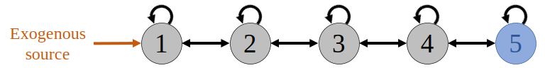

<!--
%\VignetteEngine{knitr::rmarkdown}
%\VignetteIndexEntry{Using the tdsa package for time-dependent sensitivity analysis: a more complicated example}
-->

---
title: "Using the **tdsa** package for time-dependent sensitivity analysis: an advanced example"
author:
  - "Wee Hao Ng"
date: "August 31, 2023"
link-citations: true
output:
  html_document:
    toc: true
  pdf_document: default
---

<!-- Justify text -->
<style> body{ text-align: justify } </style>

<br>

In a previous [vignette](V02_demo_translocation.html), we demonstrated how to use the **tdsa** package to perform time-dependent sensitivity analysis (TDSA), with a simple example that only involved one state variable and relatively few parameters. In this vignette, we will present another example that is more complex. Again, our focus will be on the code syntax (input arguments and output structure) rather than on the biological interpretation of the results. Since this vignette builds upon the previous vignette, we recommend going through the previous vignette first.

<br>
<hr style="border: 2px solid black">
<br>


## Exogenous disease spillover in a linear network

### Background

Some pathogens are known to have multiple host species. For example, common bee pathogens typically associated with honey bees or bumble bees have been found to infect species from other bee families (Ngor et al, 2020). However, due to variations in host competency and behaviour, pathogen persistence in a natural community may rely on only one or a small subset of species known as a maintenance subcommunity, which can then act as a reservoir for pathogen spillover to the rest of the community (Roberts & Heesterbeek, 2020).

It is useful to regard the collection of species *outside* the maintenance subcommunity as a sink subcommunity (in the context of source-sink dynamics), since the pathogen cannot persist in this subcommunity and is only maintained via spillover. Within this subcommunity, the overall risk to a species of concern depends on both the transmission network structure, as well as the risk of spillover from the reservoir to each node (Ng et al, 2023). If spillover risk varies seasonally, the most effective management intervention (in terms of which node or transmission link to target) may depend on the timing within the season. In Ng et al. (in press), we used a model to demonstrate how TDSA can help identify the most effective course of action at different times. We present this model below.

The model comprises a sink subcommunity with five species. Interspecific transmission only occurs between "nearest-neighbour" species, leading to a linear network as shown in the figure below. Such a linear network might occur if species interactions are strongly structured by trait-matching (Truitt et al., 2019), so each species only interacts with species that are adjacent along a one-dimensional trait space. We assume that exogenous spillover can only occur during the active season, so the disease is re-introduced each year at the start of the season, and dies out after the end of the season.

Species 5 is a species of management concern because it provides an important ecosystem service but has a vulnerable population, due to its low birth rate and high disease-induced mortality. To reduce disease transmission to Species 5, we may want to cull an intermediate species or dilute a transmission link, so we will use TDSA to help us identify what and when to target.



The state variables are $S_j$ and $I_j$, the number of susceptible and infected individuals in species $j$, so $N_j\equiv S_j+I_j$ gives the species population size. The dynamic equations are first-order ordinary differential equations
$$\begin{aligned} 
\frac{dS_j}{dt} &=B_j N_j (1 - a_j N_j) - S_j \left(\sigma_j + \sum_{k=1}^m b_{j,k} I_k \right) - \mu_j S_j + \gamma_j I_j,\\
\frac{dI_j}{dt} &= S_j \left(\sigma_j + \sum_{k=1}^m b_{j,k} I_k \right) - (\mu_j + \nu_j + \gamma_j) I_j,
\end{aligned}$$
where $B_j$ is the unregulated per-capita birth rate, and $a_j$ the coefficient for intraspecific reproductive competition. For a susceptible individual, $\mu_j$ is the mortality rate, while for an infected individual, $\nu_j$ is the additional disease-induced mortality rate and $\gamma_j$ the recovery rate. $b_{j,k}$ is the transmission coefficient from species $k$ to $j$, and $\sigma_j$ the per-capita exogeneous spillover rate.

Each year, Species 5 provides the ecosystem service over an active season from $t_0=0$ to $t_1=5$ in units of lifespan. (We assume that all five species are relatively short-lived, so five lifespans span one active season.) The reward $J$ represents the total value of this service, and is given by
$$J = \int_{t_0}^{t_1} \underbrace{\sum_{j=1}^5 W_j N_j}_{\substack{\text{reward}\\\text{integrand}}}\, dt+ \underbrace{\sum_{j=1}^5 V_j N_j(t_1)}_{\text{terminal payoff}},$$
where $W_j$ is the per-capita rate of contribution to the service. We also include a terminal payoff to ascribe a value to maintaining a large population at the end of the season, since this will affect the population size next season.

<br>


### Installing and loading the **tdsa** package

The **tdsa** package is already on CRAN, so it can be easily installed using the command `install.packages("tdsa")`. For the rest of this vignette, we assume that the package has already been installed.

Before proceeding further, we load the **tdsa** package.
```{r}
library(tdsa)
```

<br>


### Preparing the input arguments

Again, we need to prepare the input arguments for the function `state_sens`. However, now because there are more parameters, we need to think about how we want the parameter values to be assigned in `dynamic_fn`. The following options are available.

1. Using the argument `parms` as was done previously. Only parameters assigned this way are recognised by the function `parm_sens` used to calculate parameter sensitivities.

2. Using a different argument of our choice. This is permitted, since the `...` in `function(t, y, parms, ...)` means that we are free to introduce any additional arguments we want.

3. Within the environment of the function itself.

4. In the global environment.

Here, we will use the first two options simultaneously, by splitting the model parameters into two lists `parms` and `parms2`. `parms` contains parameters whose sensitivities we are interested in, while `parms2` is a new input argument of `dynamic_fn` that contains all other parameters. Note that this split is not really necessary---it is perfectly fine to assign all parameters using `parms` alone. However, keep in mind that the function `parm_sens` will calculate the sensitivities for *all* parameters assigned using `parms`, so we waste a lot of computation time if there are many model parameters that we are not interested in.
```{r}
parms = list(
  sigma = c(0.2, 0, 0, 0, 0),  # Per-capita exogenous spillover rate; only nonzero for Species 1.
  mu = c(1, 1, 1, 1, 1),  # Mortality rate of a susceptible individual.
  b = matrix(c(1.976537, 1.976537, 0.000000, 0.000000, 0.000000,
               1.976537, 1.976537, 1.976537, 0.000000, 0.000000,
               0.000000, 1.976537, 1.976537, 1.976537, 0.000000,
               0.000000, 0.000000, 1.976537, 1.976537, 1.976537,
               0.000000, 0.000000, 0.000000, 1.976537, 1.976537),
             nrow=5, byrow=TRUE)  # Matrix of transmission coefficients; values chosen so that disease R_0 = 0.9.
)

parms2 = list(
  B = c(5, 5, 5, 5, 1.02),  # Unregulated per-capita birth rate; low for Species 5.
  a = c(0.8, 0.8, 0.8, 0.8, 0.02),  # Intraspecific competition; chosen so all species have disease-free carrying capacity = 1.
  nu = c(0, 0, 0, 0, 5),  # Disease-induced mortality of an infected individual; only nonzero for Species 5.
  gamma = c(5, 5, 5, 5, 0)  # Recovery rate of an infected individual; zero for species 5.
)
```

Now we specify `dynamic_fn`. Since there are five species, each with two compartments (susceptible and infected), the input argument `y` is a numeric vector of length 10, corresponding to the state vector
$$\vec{y}=\begin{pmatrix}\vec{S}\\\vec{I}\end{pmatrix}, \quad \vec{S}=(S_1, S_2, S_3, S_4, S_5)^{\mathsf{T}}, \quad \vec{I}= (I_1, I_2, I_3, I_4, I_5)^{\mathsf{T}}.$$
`dynamic_fn` must return a list, the first element a numeric vector of length 10 corresponding to the RHS of the dynamic equations (in vector form)
$$\frac{d\vec{y}}{dt}
=\begin{pmatrix}\frac{d\vec{S}}{dt}\\ \frac{d\vec{I}}{dt}\end{pmatrix}
=\begin{pmatrix} \vec{B} \circ\vec{N}\circ(1-\vec{a}\circ\vec{N})-\vec{S}\circ(\vec{\sigma}+\mathbf{b}\vec{I}) -\vec{\mu}\circ\vec{S}+\vec{\gamma}\circ\vec{I}  \\ \vec{S}\circ(\vec{\sigma}+\mathbf{b}\vec{I}) -(\vec{\mu}+\vec{\nu}+\vec{\gamma})\circ\vec{I} \end{pmatrix}.$$
Here, $\circ$ corresponds to the Hadamard (element-wise) product, while all the model parameters have been grouped into vectors and matrices such as $\vec{B}$ or $\mathbf{b}$.
```{r}
dynamic_fn = function(t, y, parms, parms2){
  # To make the lines below easier to read, we "extract" each coefficient from the parameter lists.
  mu = parms[["mu"]]
  b = parms[["b"]]
  sigma = parms[["sigma"]]
  
  B = parms2[["B"]]
  a = parms2[["a"]]
  nu = parms2[["nu"]]
  gamma = parms2[["gamma"]]
  
 # To make the lines below easier to read, we "extract" the susceptible and infected parts from the state vector.
  SS = y[1:5 ]
  II = y[6:10]
  
  # Calculate the species population size.
  NN = SS + II
  
  # RHS of the dynamic equations.
  dSS = B * NN * (1 - a*NN) - SS * (sigma + b%*%II) - mu * SS + gamma * II
  dII = SS * (sigma + b%*%II) - (mu + nu + gamma) * II
  
  return( list( c(dSS, dII) ) )
}
```

Next, we need to specify `reward_fn` and `terminal_fn` for the reward integrands and terminal payoffs.
```{r}
reward_fn = function(t, y){
  # Parameters.
  W = c(0, 0, 0, 0, 1)  # Per-capita rate of contribution to ecosystem service; only nonzero for Species 5.

  # Split the state vector.
  SS = y[1:5]
  II = y[6:10]
  
  # Return the reward integrand.
  NN = SS + II
  return( sum(W * NN) )
}


terminal_fn = function(y){
  # Parameters.
  V = c(0, 0, 0, 0, 1)  # Per-capita terminal payoff; only nonzero for Species 5.

  # Split the state vector.
  SS = y[1:5]
  II = y[6:10]
  
  # Return the terminal payoff.
  NN = SS + II
  return( sum(V*NN) )
}
```

Next, we need to specify `y_0`, the initial conditions $\vec{y}(t_0)$. We assume that the subcommunity starts off disease-free at the carrying capacity $K_j = (1-\mu_j/B_j)/a_j$.
```{r}
SS_0 = (1-parms[["mu"]]/parms2[["B"]])/parms2[["a"]]     # At carrying capacity.
II_0 = c(0, 0, 0, 0, 0)  # Disease-free.
y_0  = c(SS_0, II_0)
```

Finally, since this is a continuous-time model, we need to discretise the continuous time interval between the initial and final times $t_0=0$ and $t_1=5$. We choose 1001 time steps, so the step size is 0.005. When using the function `seq`, it is more "fail-safe" to specify the argument `length.out` (number of time steps) instead of `by` (step size), to ensure that $t_1$ is always the final time step.
```{r}
t_0 = 0
t_1 = 5
times = seq(from=t_0, to=t_1, length.out=1001)
```

<br>

### Calculating time-dependent state sensitivities

We calculate time-dependent state sensitivities using the function `state_sens`. Since `parms2` is a new argument of `dynamic_fn`, we use the argument `dynamic_fn_arglist` to specify it in `state_sens`.
```{r, results="hide"}
state_sens_out = state_sens(
  model_type = "continuous",
  dynamic_fn = dynamic_fn,
  parms = parms,
  reward_fn = reward_fn,
  terminal_fn = terminal_fn,
  y_0 = y_0,
  times = times,
  dynamic_fn_arglist = list(parms2 = parms2),
  verbose = FALSE
)
```

As before, the output is a list that contains some input arguments, as well as the matrices `state` and `tdss`. These matrices now have 10 columns, since there are now 10 state variables, and also the following 10 state sensitivities
$$\vec{\lambda}=\begin{pmatrix}\vec{\lambda}_S\\\vec{\lambda}_I \end{pmatrix}, \quad \vec{\lambda}_S=(\lambda_{S_1},\lambda_{S_2},\lambda_{S_3},\lambda_{S_4},\lambda_{S_5})^{\mathsf{T}},\quad \vec{\lambda}_I=(\lambda_{I_1},\lambda_{I_2},\lambda_{I_3},\lambda_{I_4},\lambda_{I_5})^{\mathsf{T}}.$$
```{r}
str(state_sens_out)
```

In the left panel below, we plot the disease prevalence $P_j\equiv I_j/N_j$ in each species, calculated from the `state` matrix. Since the disease has to be relayed down the transmission chain, not surprisingly the prevalence is a lot lower in Species 5, and also the rise is more delayed. In the right panel, we plot $-\lambda_{N_j}$, defined as $\lambda_{N_j}=(1-P_j)\lambda_{S_j}+P_j\lambda_{I_j}$. This represents the sensitivity of the reward $J$ to random culling of Species $j$, regardless of infection status. (It makes no sense to cull Species 5 so we have excluded it from the plot.) We find that early in the season, it is more effective to cull a species that is upstream along the transmission chain, whereas the reverse is true late in the season. This is indeed intuitively what we expect&mdash;culling a downstream species too early is ineffective since the population would have recovered somewhat by the time the disease reaches the species, while culling an upstream species too late is also ineffective since the disease is already being transmitted among the downstream species.
```{r, fig.dim=c(12,6)}
# Calculate the derived quantities to be plotted.

# Disease prevalence:
SS = state_sens_out[["state"]][, 1:5]  # Number of susceptible individuals.
II = state_sens_out[["state"]][, 6:10]  # Number of infected individuals.
NN = SS + II  # Species population size.
PP = II / NN  # Disease prevalence.

# State sensitivities:
lambda_SS = state_sens_out[["tdss"]][, 1:5]  # State sensitivities for S_j.
lambda_II = state_sens_out[["tdss"]][, 6:10]  # State sensitivities for I_j.
lambda_NN = (1 - PP) * lambda_SS + PP * lambda_II

# Generate the plots.
palette = c("#42049EFF", "#900DA4FF", "#CC4678FF", "#F1844BFF", "#FCCE25FF")  # Colour palette.

par(mar=c(5,6.7,4,1.7)+0.1, mfrow=c(1,2))  # Set graphical parameters.

# Plot PP.
plot(NA, xlim=c(0, 5), ylim=c(0.00067, 1), log="y", xaxs="i", yaxs="i", yaxt="n",
     main="Infection dynamics",
     xlab="Time (in units of lifespan)",
     ylab="Fraction of population infected (log scale)",
     cex.main=2, cex.lab=1.5, cex.axis=1.5)
axis(side=2, cex.axis=1.5, at=10^((-4):(0)), labels=c(0.0001, 0.001, 0.01, 0.1, 1))
for(i in 1:5){
  lines(times, PP[,i], lwd=3, col=palette[i])
}
legend("topright", legend=paste("Species",1:5), lwd=3, col=palette[1:5], bty="n")

# Plot lambda_NN.
plot(NA, xlim=c(0, 5), ylim=c(0, 0.11), xaxs="i", yaxs="i",
     main="Time-dep. state sensitivities",
     xlab="Time (in units of lifespan)",
     ylab=bquote(atop("Sensitivity of J to sudden decrease", "in species population "~(-lambda[N["j"]]))),
     cex.main=2, cex.lab=1.5, cex.axis=1.5)
for(i in (1:4)){
  lines(times, -lambda_NN[,i], lwd=3, col=palette[i])
}
legend("topright", legend=paste("Species",1:4), lwd=3, col=palette[1:4], bty="n")
```

<br>

### Calculating time-dependent parameter sensitivities

Again, calculating the parameter sensitivities is easy, since it only involves using the output of `state_sens` as the input argument of the function `parm_sens`. To speed up the calculation of numerical derivatives, we will also use the optional argument `numDeriv_arglist` to reduce the number of Richardson iterations to two (see the **numDeriv** package help for details).
```{r, results="hide"}
parm_sens_out = parm_sens(state_sens_out = state_sens_out,
                          numDeriv_arglist = list(method.args=list(r=2)),
                          verbose = FALSE)
```

As before, the output is a list containing `times`, and an object called `tdps` that gives the time-dependent parameter sensitivity. In this example, `parms` is a list containing two vectors `sigma` and `mu` and a matrix `b`, so `tdps` is a list containing two matrices and a 3-index array that give the parameter sensitivities of `sigma`, `mu` and `b` respectively.
```{r}
str(parm_sens_out)
```

In the left panel below, we plot (excluding Species 5) $\kappa_{\mu_j}$, the parameter sensitivities of $\mu_j$. We note that the shape is similar to the negative of the state sensitivities $-\lambda_{N_j}$, which is not surprising because a brief spike in mortality leads to a sudden decrease in the population size. In the right panel, we plot $-\kappa_{b_{j+1,j}}$, the negative of the parameter sensitivities of the forward transmission coefficients $b_{2,1}$, $b_{3,2}$, etc. We find that early in the season, it is more effective to target an upstream transmission link, whereas the reverse is true late in the season. This is again an intuitive result.

```{r, fig.dim=c(12,6)}
# Extract the list containing the parameter sensitivities.
tdps = parm_sens_out[["tdps"]]

# Parameter sensitivities for the mortality rate of a susceptible individual.
kappa_mu = tdps[["mu"]]

# Parameter sensitivities for the forward transmission rate b_{2,1}, b_{3,2}, etc.
# These are given by tdps[["b"]][,2,1], tdps[["b"]][,3,2], etc.
# A more systematic way to extract these elements is to use mapply.
kappa_b = mapply(function(i,j){tdps[["b"]][,i,j]}, 2:5, 1:4)


# Generate the plots.
palette = c("#42049EFF", "#900DA4FF", "#CC4678FF", "#F1844BFF", "#FCCE25FF")  # Colour palette.

par(mar=c(5,6.7,4,1.7)+0.1, mfrow=c(1,2))  # Set graphical parameters.

# Plot kappa_mu.
plot(NA, xlim=c(0, 5), ylim=c(0, 0.11), xaxs="i", yaxs="i",
     main="Time-dep. parm. sensitivities",
     xlab="Time (in units of lifespan)",
     ylab=bquote(atop("Sensitivity of J to brief increase", "in mortality of susceptibles "~(kappa[mu["j"]]))),
     cex.main=2, cex.lab=1.5, cex.axis=1.5)
for(i in 1:4){
  lines(times, kappa_mu[,i], lwd=3, col=palette[i])
}
legend("topright", legend=paste("Species",1:4), lwd=3, col=palette[1:4], bty="n")

# Plot kappa_b
plot(NA, xlim=c(0, 5), ylim=c(0, 0.077), xaxs="i", yaxs="i",
     main="Time-dep. parm. sensitivities",
     xlab="Time (in units of lifespan)",
     ylab=bquote(atop("Sensitivity of J to brief decrease", "in forward transmission "~(-kappa[b["j+1, j"]]))),
     cex.main=2, cex.lab=1.5, cex.axis=1.5)
for(i in 1:4){
  lines(times, -kappa_b[,i], lwd=3, col=palette[i])
}
legend("topright", legend=paste("Species", 1:4, "to", 2:5), lwd=3, col=palette[1:4], bty="n")
```

Finally, we plot $-\kappa_{\sigma_1}$, the negative of the parameter sensitivity of $\sigma_1$, the exogenous spillover rate to Species 1. (We omit the other $\sigma_{j\ne 1}$ since the model assumes no exogenous spillover to other species.) We see that it is most effective to target the exogenous disease source and reduce the spillover rate $\sigma_1$ as early as possible. Later in the season the disease is already being transmitted among the "downstream" species, so reducing the exogenous spillover to Species 1 (which is upstream) becomes a lot less effective.
```{r, fig.dim=c(6,6), out.width="50%"}

# Parameter sensitivity for the exogenous spillover rate to Species 1.
kappa_sigma_1 = tdps[["sigma"]][,1]

# Generate the plot.
par(mar=c(5,6.7,4,1.7)+0.1)  # Set graphical parameters.
plot(times, -kappa_sigma_1, xlim=c(0, 5), ylim=c(0, 0.72), xaxs="i", yaxs="i",
     type="l", lwd=3,
     main="Time-dep. parm. sensitivity",
     xlab="Time (in units of lifespan)",
     ylab=bquote(atop("Sensitivity of J to brief decrease", "in exogeneous spillover to Species 1 "~(kappa[sigma["1"]]))),
     cex.main=2, cex.lab=1.5, cex.axis=1.5)
```


## Bibliography

Ng, W. H., Myers, C. R., McArt, S., & Ellner, S. P. (2023). Predicting and Controlling Spillover in Multispecies Disease Transmission Networks: Steady-State Analysis. *American Naturalist*, 201, 880&ndash;894. doi: [10.1086/724009](https://doi.org/10.1086/724009).


Ng, W. H., Myers, C. R., McArt, S., & Ellner, S. P. (in press). A time for every purpose: using time-dependent sensitivity analysis to help understand and manage dynamic ecological systems. *American Naturalist*. doi: [10.1086/726143](https://doi.org/10.1086/726143). eprint doi: [10.1101/2023.04.13.536769](https://doi.org/10.1101/2023.04.13.536769).

Ng, W. H., Myers, C. R., McArt, S., & Ellner, S. P. (in review). **tdsa**: An R package to perform time-dependent sensitivity analysis. *Methods in Ecology and Evolution*.

Ngor, L., Palmer-Young, E. C., Burciaga Nevarez, R., Russell, K. A., Leger, L., Giacomini, S. J., Pinilla-Gallego, M. S., Irwin, R. E., & McFrederick, Q. S. (2020). Cross-infectivity of honey and bumble bee-associated parasites across three bee families. *Parasitology*, 12, 1290&ndash;1304. doi: [10.1017/S0031182020001018](https://doi.org/10.1017/S0031182020001018)

Roberts, M. G., & Heesterbeek, J. A. P. (2020). Characterizing reservoirs of infection and the maintenance of pathogens in ecosystems. *Journal of The Royal Society Interface*, 17, 2019054. doi: [10.1098/rsif.2019.0540](https://doi.org/10.1098/rsif.2019.0540).

Truitt, L. L., McArt, S. H., Vaughn, A. H., & Ellner, S. P. (2019). Trait-based modeling of multi-host pathogen transmission: Plant-pollinator networks. *American Naturalist*, 193, E149&ndash;E167. doi: [10.1086/702959](https://doi.org/10.1086/702959).